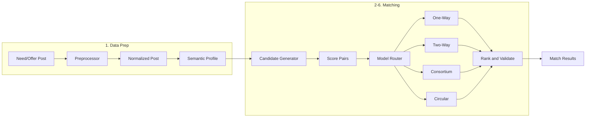

# Matching Algorithm (Step-by-Step) Implementation Plan

## Current State vs Spec

| Aspect        | Current                                                | Spec                                                                           |
| ------------- | ------------------------------------------------------ | ------------------------------------------------------------------------------ |
| Matching unit | Opportunity ↔ **User/Company** (candidate)             | **Need Post ↔ Offer Post** (post-to-post) + four models                        |
| Scoring       | Point-based (skills 50, sectors 15, …) then normalized | Weighted: Attribute 40%, Budget 30%, Timeline 15%, Location 10%, Reputation 5% |
| Pipeline      | Direct score-all                                       | Preprocess → (semantic) → **Candidate generation** → Score → Model → Rank      |
| Normalization | None                                                   | Skills, budget ranges, dates, location                                         |
| Semantic      | None                                                   | Structured + text embeddings + category tags                                   |
| Models        | Single “opportunity–candidate” flow                    | One-Way, Two-Way Barter, Group Formation, Circular Exchange                    |

Existing assets to reuse:

- [POC/src/services/matching/matching-service.js](POC/src/services/matching/matching-service.js) — scoring and model-specific logic (today: opportunity ↔ user).
- [POC/src/core/data/data-service.js](POC/src/core/data/data-service.js) — `getOpportunities()`, `getMatches()`, `createMatch()`.
- Opportunity shape in [docs/modules/opportunity-creation.md](docs/modules/opportunity-creation.md) and [POC/data/opportunities.json](POC/data/opportunities.json): `intent` (request/offer), `scope`, `attributes`, `exchangeData`, `location`*, dates in attributes.

---

## 1. Data Preparation (Pre-Processing)

**Goal:** When a user creates or updates a Need/Offer (opportunity), standardize and store comparable attributes.

**1.1 Extract structured attributes from each post**

- Add a **normalized payload** (or dedicated fields) on the opportunity, populated on create/update:
  - **Category / skills:** from `scope.requiredSkills` (Need) or `scope.offeredSkills` (Offer); plus model-specific (e.g. `attributes.requiredSkills`, `attributes.resourceType`).
  - **Budget or expected rate:** from `exchangeData.budgetRange`, `exchangeData.cashAmount`, `attributes.price`, or model-specific budget fields; store as numeric min/max (e.g. SAR).
  - **Timeline:** from `attributes.startDate`, `attributes.duration`, `attributes.projectDuration`, `attributes.availability` (date-range); derive start/end or “duration + start”.
  - **Deadline (Need) / Availability (Offer):** from `attributes.tenderDeadline`, `attributes.availability`, or equivalent; normalize to ISO date or range.
  - **Location:** from `location`, `locationCountry`, `locationRegion`, `locationCity`, `locationDistrict`, or `attributes.locationRequirement` (Remote/On-Site/Hybrid).
  - **Reputation / rating:** from creator’s profile (e.g. rating, completion count) if available; otherwise default.

**1.2 Normalize the data**

- **Skill normalization:** Maintain a **skill synonym / canonical map** (e.g. in [POC/data/lookups.json](POC/data/lookups.json) or new `skill-canonical.json`). Map variants (e.g. "AutoCAD", "Autocad", "Auto-CAD") to one canonical key; use it when writing the normalized payload and when matching.
- **Budget:** Parse and store as `{ min: number, max: number, currency }`; convert to a single “comparison” band (e.g. mid-range or min) for compatibility checks.
- **Dates:** Normalize to ISO and/or “start + duration (days)” so timeline overlap is computable.
- **Location:** Standardize to a small set: e.g. "Remote" | "KSA" | "Riyadh" | "Jeddah" | … (from existing `locationCountry`/`locationRegion`/city or free text parsing).

**Deliverables**

- **Preprocessing service** (e.g. `POC/src/services/matching/post-preprocessor.js`): `extractAndNormalize(opportunity) → normalizedPost`.
- **Canonical skill map** and location enum/parser; config or lookups for budget/date rules.
- **Hook** in opportunity create/update (e.g. in [POC/src/services/opportunities/opportunity-service.js](POC/src/services/opportunities/opportunity-service.js) or where opportunities are persisted): after save, call preprocessor and store result on the opportunity (e.g. `normalized: { ... }`) or in a separate store keyed by opportunity id.

---

## 2. Semantic Representation

**Goal:** Support “semantic” matching (related concepts, not only exact keywords).

**2.1 Structured attributes**

- Already covered by the normalized payload (category, skills, location, timeline, budget, reputation).

**2.2 Text embeddings (optional / phased)**

- **Option A (MVP):** No external API. Use **category tags + expanded keywords**: map description/title to categories (e.g. from lookups) and to a small set of keywords/synonyms (e.g. “shop drawing review” → “Structural Engineering” in skill/category map). Matching then uses canonical skills + category overlap; no vector DB.
- **Option B (later):** Integrate an embedding API (e.g. OpenAI, or backend embedding service). Store a vector per post (e.g. `embedding: number[]`). Candidate generation or scoring can use cosine similarity as an extra signal or filter.

**2.3 Category tags**

- Ensure each post has a **category/subModel** (e.g. from `modelType`/`subModelType` and scope). Use for “same or related category” in candidate generation.

**Deliverables**

- **Category/skill expansion map** (e.g. “Shop drawing review” → Structural Engineering) in lookups or preprocessor.
- **Semantic profile** structure: `{ structured: normalizedPost, categoryTags: string[], expandedSkillsOrCategories?: string[] }`; optional `embedding` when Option B is implemented.
- Preprocessor (or a separate `semantic-profile.js`) builds this profile and stores it on the opportunity or in a matching-specific store.

---

## 3. Candidate Generation

**Goal:** Avoid comparing every Need to every Offer; filter first, then score.

**3.1 Filtering rules**

- **Intent:** Need (request) ↔ Offer (offer) only (or configurable).
- **Category:** Same or related `modelType`/`subModelType` (or expanded categories from semantic profile).
- **Budget:** Offer’s range overlaps or satisfies Need’s range (e.g. Need max >= Offer min; or within X%).
- **Location:** Compatible (Remote matches all; same city/region; or “KSA” vs “Riyadh” overlap).
- **Timeline:** Overlapping availability/deadline windows (e.g. Need deadline after Offer start; or both ranges overlap).

**3.2 Implementation**

- **Candidate generator** (e.g. in `matching-service.js` or `candidate-generator.js`): `getCandidates(needPost, allOfferPosts, options) → offerPosts[]`.
- Apply filters above; optionally cap (e.g. top 200 by a cheap heuristic: category match + location match) then pass to scoring.
- For **Two-Way / Circular**, candidate generation may be “all other posts” or “posts with intent opposite to this post,” then bidirectional/cycle logic applies.

**Deliverables**

- `getCandidates(needPost, offerPosts, { maxCandidates })` returning a reduced list of Offer posts.
- Config (e.g. in [POC/src/core/config/config.js](POC/src/core/config/config.js)): `MATCHING.CANDIDATE_MAX`, and toggles for each filter.

---

## 4. Match Scoring (Post-to-Post)

**Goal:** One weighted score per (Need, Offer) with your weights and attribute labels.

**4.1 Weights**

- Attribute Overlap: **40%**
- Budget Fit: **30%**
- Timeline Compatibility: **15%**
- Location Match: **10%**
- Reputation: **5%**

**4.2 Computation**

- **Attribute overlap (40%):** Compare normalized skills/categories (and optional embedding similarity if Option B). Score = ratio of matched canonical skills/categories (e.g. Jaccard or matched/total). Use expanded/semantic terms so “shop drawing review” can match “Structural Engineering.”
- **Budget fit (30%):** Need budget range vs Offer price/rate range. Full match if fully inside; partial if overlap; no match if disjoint. Map to 0 / 0.5 / 1 (or continuous) and multiply by 0.30.
- **Timeline (15%):** Overlap of Need deadline/period and Offer availability; 0–1 scale.
- **Location (10%):** Remote = match all; same city = 1; same region = partial; else 0. Multiply by 0.10.
- **Reputation (5%):** Creator rating or default; 0–1 scale × 0.05.

**4.3 Labels**

- For each factor, set a label: **Match** / **Partial** / **No Match** (e.g. thresholds: 1 = Match, 0.25–0.99 = Partial, <0.25 = No Match).

**Deliverables**

- **Post-to-post scoring function:** `scorePair(needPost, offerPost, normalizedNeed, normalizedOffer) → { score, breakdown: { attributeOverlap, budgetFit, timelineFit, locationFit, reputation }, labels: { … } }`.
- Reuse or share logic with existing `calculateMatchScore` where it compares the same concepts (e.g. budget, location) so behavior stays consistent for opportunity–candidate path if that remains.

---

## 5. Matching Models

**Goal:** Implement four flows and route each Need/Offer through the correct one.

**5.1 Model 1: One-Way (Simple)**

- **When:** Default for standard service request (Need → find Offers).
- **Logic:** For a Need post, run candidate generation → score each (Need, Offer) → rank by score → return top N (e.g. 20) with score and breakdown.
- **Implementation:** `findOffersForNeed(needPostId)` in matching service; optionally persist results in `pmtwin_matches` with a `matchType: 'one_way'` and `opportunityId` (Need) + `matchedOpportunityId` (Offer).

**5.2 Model 2: Two-Way (Barter)**

- **When:** Both users have Offer and Need (e.g. User A: Offer O_A, Need N_A; User B: Offer O_B, Need N_B).
- **Logic:** Require **O_A satisfies N_B** and **O_B satisfies N_A**. Use post-to-post score for (N_A, O_B) and (N_B, O_A); both must be above threshold.
- **Value equivalence (fairness):** Compare “value” of O_A vs N_B and O_B vs N_A (e.g. 1 month office = 25K SAR, engineering hour = 625 SAR → 40 hours). Implement a **value estimator** (e.g. from `exchangeData.barterValue`, `cashAmount`, or fixed rates by category) and return a suggested equivalence (e.g. “40 engineering hours”) in the match result.
- **Implementation:** `findBarterMatches(opportunityId)` that finds other posts where creator has both Need and Offer; run bidirectional score + value equivalence; return pairs with both scores above threshold and equivalence note.

**5.3 Model 3: Group Formation (Consortium)**

- **When:** One “lead” Need (e.g. highway project) requires multiple contributions (financing, construction, equipment).
- **Logic:** From the lead Need, **decompose** into required components (e.g. from `memberRoles` / `requiredMembers` in consortium model). For each component, run One-Way matching (component as “need”) to find best Offer posts. Then **select a set of partners** that maximize coverage, compatibility, and optional value balance.
- **Implementation:** `findConsortiumCandidates(leadNeedId)` that: (1) parses required roles/components from the opportunity; (2) for each role, runs candidate generation + scoring against Offer posts; (3) aggregates and ranks combinations (e.g. greedy: pick best per role, then check no duplicate creators); (4) returns suggested consortium (Lead + Partner_1 + … + Partner_k) with per-role match scores.

**5.4 Model 4: Circular Exchange (Multi-Party Barter)**

- **When:** Three or more users can form a closed loop: A→B→C→A (each offers what the next needs).
- **Logic:** Build **directed graph**: nodes = posts (or users); edge (A, B) if Offer_A satisfies Need_B (score ≥ threshold). **Search for cycles** of length ≥ 3 (e.g. DFS or dedicated cycle-finding). For each cycle, validate all edges above threshold and optionally value balance.
- **Implementation:** `findCircularExchanges(minCycleLength = 3)` that: (1) gets all Need/Offer posts (or recent); (2) builds graph from post-to-post scores; (3) enumerates cycles; (4) returns cycles with match details and optional value equivalence.

**Deliverables**

- **Routing:** Decide model from post metadata (e.g. `exchangeMode === 'barter'` + has both Need and Offer → Two-Way; `subModelType === 'consortium'` → Group; optional “circular” flag or run circular for all barter posts).
- **API:** `findMatchesForPost(opportunityId, options)` that returns `{ model: 'one_way'|'two_way'|'consortium'|'circular', matches: [...] }`.
- **Data model:** Store post-to-post matches (e.g. `matchedOpportunityId`, `matchType`, `valueEquivalence`) in addition to existing opportunity–candidate matches; ensure UI and data layer can distinguish.

---

## 6. Final Match Ranking and Output

**Goal:** Consistent ranking, validation, and response shape.

- **Rank** by match score (desc); for Group, rank by aggregate coverage/score; for Circular, by cycle strength or balance.
- **Validate:** Value equivalence only for Two-Way and Circular; remove duplicate partners in Consortium; same post not appearing twice in a cycle.
- **Output shape (per match):** Match score, attribute breakdown (with Match/Partial/No Match labels), value equivalence (if barter/circular), suggested partners (post ids + creator ids).

**Deliverables**

- **Ranking and deduplication** in each model’s function.
- **Unified result format** for UI: e.g. `{ matchScore, breakdown, labels, valueEquivalence?, suggestedPartners: [{ opportunityId, creatorId, role? }] }`.
- **Docs:** Update [docs/modules/application.md](docs/modules/application.md) (and any BRD) with the new matching pipeline and the four models.

---

## 7. Integration and Backward Compatibility

- **Opportunity–candidate matching:** Keep existing `findMatchesForOpportunity(opportunityId)` and `findOpportunitiesForCandidate(candidateId)` for flows that recommend **users** to an opportunity (or opportunities to a user). Optionally reuse the same normalization and scoring factors where they apply (e.g. budget, location) so both paths stay consistent.
- **Triggers:** Run post-to-post matching when an opportunity is published (and optionally on a schedule or on-demand from a “Find matches” button). Store results so the Find/Opportunities UI can show “Top matching Offers” for a Need (and vice versa).
- **UI:** Add or extend Find/Opportunities pages to show post-to-post matches (e.g. “Matches for this Need” with score, breakdown, and suggested partners); and for barter/consortium/circular, show value equivalence and multi-party suggestions.

---

## Architecture Overview

---

## Suggested File Layout

- `POC/src/services/matching/post-preprocessor.js` — extract + normalize; call from opportunity save.
- `POC/src/services/matching/semantic-profile.js` — (optional) build semantic profile + expansion.
- `POC/src/services/matching/candidate-generator.js` — filter to candidate list.
- `POC/src/services/matching/post-to-post-scoring.js` — weighted score + labels.
- `POC/src/services/matching/matching-models.js` — One-Way, Two-Way, Consortium, Circular.
- `POC/src/services/matching/matching-service.js` — orchestration: call preprocessor, candidate gen, scoring, model routing, ranking; keep existing opportunity–candidate methods.
- `POC/data/skill-canonical.json` or extend `lookups.json` — skill synonyms and category expansion.
- Config: add `MATCHING.CANDIDATE_MAX`, `MATCHING.WEIGHTS`, `MATCHING.POST_TO_POST_THRESHOLD`.

---

## Testing and Rollout

- **Unit tests:** Preprocessor output for sample opportunities; scoring for known Need/Offer pairs; cycle detection for a small graph.
- **Phasing:** Implement One-Way first (preprocess → candidate gen → score → rank), then Two-Way (value equivalence), then Consortium, then Circular. Semantic embeddings can be added in a later phase (Option B).

